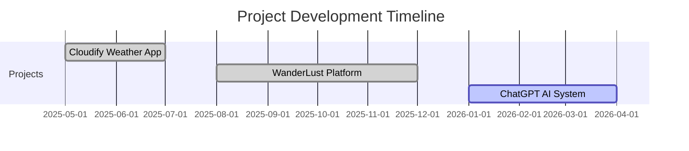

<div align="center">

<!-- Animated Wave Header -->


<!-- Typing Animation -->
<h1>
  
</h1>

<!-- Animated Subtitle -->
<p align="center">
  
</p>

<!-- Social Badges with Hover Effect -->
<p align="center">
  <a href="https://github.com/Sarfarazsfz" target="_blank">
    
  </a>
  <a href="https://www.linkedin.com/in/faraz4237" target="_blank">
    
  </a>
  <a href="mailto:mdsarfarazalam669@gmail.com">
    
  </a>
  <a href="https://twitter.com/your_handle" target="_blank">
    
  </a>
</p>

<!-- Animated Profile Stats -->
<div align="center">
  
  
  
</div>

<br/>

<!-- Animated Separator -->


</div>

##  About Me

```javascript
const sarfaraz = {
    role: "Full-Stack Developer",
    specialization: "MERN Stack",
    currentFocus: "AI-Powered Web Applications",
    education: "BTech CSE @ VFSTR (2024-2027)",
    
    technologies: {
        frontend: ["React.js", "Next.js", "Tailwind CSS", "Material UI"],
        backend: ["Node.js", "Express.js", "REST APIs"],
        database: ["MongoDB", "MySQL", "MongoDB Atlas"],
        devOps: ["Git", "GitHub", "Render", "Vercel", "Docker", "AWS"],
        languages: ["Java", "JavaScript (ES6+)"]
    },
    
    currentlyBuilding: ["AI Conversational Systems", "E-Commerce Platforms"],
    stats: {
        dailyAPIRequests: "3,000+",
        monthlyUsers: "300+",
        projectUptime: "99.9%",
        linesOfCode: "50,000+"
    },
    
    openTo: ["Full-Stack Developer", "Software Engineer", "MERN Developer"],
    motto: "Turning coffee ☕ into code 💻, one commit at a time! 🚀"
};
```


##  Tech Stack & Tools

<div align="center">

### 🎯 Core Technologies

<table>
<tr>
    <td align="center" width="96">
        
        <br>React
    </td>
    <td align="center" width="96">
        
        <br>Node.js
    </td>
    <td align="center" width="96">
        
        <br>Express
    </td>
    <td align="center" width="96">
        
        <br>MongoDB
    </td>
    <td align="center" width="96">
        
        <br>JavaScript
    </td>
    <td align="center" width="96">
        
        <br>TypeScript
    </td>
    <td align="center" width="96">
        
        <br>Next.js
    </td>
    <td align="center" width="96">
        
        <br>Tailwind
    </td>
</tr>
<tr>
    <td align="center" width="96">
        
        <br>HTML5
    </td>
    <td align="center" width="96">
        
        <br>CSS3
    </td>
    <td align="center" width="96">
        
        <br>Redux
    </td>
    <td align="center" width="96">
        
        <br>MySQL
    </td>
    <td align="center" width="96">
        
        <br>Git
    </td>
    <td align="center" width="96">
        
        <br>GitHub
    </td>
    <td align="center" width="96">
        
        <br>VS Code
    </td>
    <td align="center" width="96">
        
        <br>Postman
    </td>
</tr>
<tr>
    <td align="center" width="96">
        
        <br>Java
    </td>
    <td align="center" width="96">
        
        <br>Python
    </td>
    <td align="center" width="96">
        
        <br>C
    </td>
    <td align="center" width="96">
        
        <br>Vercel
    </td>
    <td align="center" width="96">
        
        <br>Vite
    </td>
    <td align="center" width="96">
        
        <br>Material UI
    </td>
    <td align="center" width="96">
        
        <br>Bash
    </td>
    <td align="center" width="96">
        
        <br>Docker
    </td>
</tr>
</table>

</div>


##  Featured Projects

<div align="center">

### 🌟 Production-Ready MERN Stack Applications

</div>

<table>
<tr>
<td width="50%">

### 🤖 ChatGPT-Like AI System
[](https://your-demo-link.com)
[](https://github.com/Sarfarazsfz/chatgpt-ai)


**Full-stack AI conversational chatbot with real-time processing**

**🚀 Key Features:**
- 💬 1,000+ daily API requests with 95% uptime
- 🔐 JWT authentication for 150+ users
- ⚡ 40% faster data retrieval
- 📊 10,000+ conversation records

**⚙️ Tech Stack:**
```
React.js • Node.js • Express.js
MongoDB • JWT • REST APIs
```

</td>
<td width="50%">

### 🏠 WanderLust Platform
[](https://wanderlust-xz5o.onrender.com/listings)
[](https://github.com/Sarfarazsfz/WanderLust)


**Airbnb-style property rental platform with 500+ listings**

**🚀 Key Features:**
- 🗺️ Mapbox integration (2,000+ queries/month)
- 🔒 Passport.js authentication
- 📸 Cloudinary (800+ images)
- ⚡ 45% faster page loads
- ✅ 99.9% uptime

**⚙️ Tech Stack:**
```
Node.js • Express.js • MongoDB
JavaScript • EJS(Embedded JavaScript) • Mapbox • Cloudinary
```

</td>
</tr>

<tr>
<td width="50%">

### 🌦️ Cloudify Weather App
[](https://cloudify-n776.onrender.com)
[](https://github.com/Sarfarazsfz/Cloudify)


**Real-time weather data for 10,000+ cities worldwide**

**🚀 Key Features:**
- 🌍 OpenWeather API integration
- 🎨 Material UI components
- ⚡ Sub-second load times
- 📱 Fully responsive design
- ⭐ 85+ Lighthouse score

**⚙️ Tech Stack:**
```
React.js • Vite • JavaScript
Material UI • OpenWeather API
```

</td>
<td width="50%">

### 🗳️ Digital Spring Vote
[](https://sarfarazsfz.github.io/springvote-react/)
[](https://github.com/Sarfarazsfz/springvote-react)


**Modern voting platform with intuitive UI**

**🚀 Key Features:**
- 🎨 Leading IDP project team
- ⚛️ React-based architecture
- 📱 Mobile-responsive design
- 🎯 Clean, modern interface

**⚙️ Tech Stack:**
```
React.js • JavaScript
HTML5 • CSS3
```

</td>
</tr>
</table>

<details>
<summary><b>🎮 More Projects (Click to Expand)</b></summary>
<br>

### JavaScript & Frontend Projects

| Project | Description | Tech Stack | Links |
|---------|------------|------------|-------|
| 🎮 **Simon Says Game** | Interactive memory-based game with smooth animations | JS, HTML, CSS | [Demo](https://sarfarazsfz.github.io/Simon-Says-Game/) • [Code](https://github.com/sarfarazsfz/Simon-Says-Game) |
| 🛒 **Seasro Marketplace** | E-commerce platform (In Development) | React, Node.js | [Code](https://github.com/Sarfarazsfz/Seasro-Marketplace) |
| 🔢 **Counter App** | Interactive counter with React hooks | React.js | [Demo](https://counter-app-tau-orcin.vercel.app/) • [Code](https://github.com/Sarfarazsfz/counter-app) |
| 🎵 **Spotify Clone** | Responsive Spotify UI recreation | HTML, CSS, JS | [Demo](https://sarfarazsfz.github.io/Spotify-Web-Player-UI-Clone/) |
| 🎨 **Color Generator** | Dynamic color tool with DOM manipulation | JavaScript | [Demo](https://sarfarazsfz.github.io/Random-Color-Generator/) |
| 🧭 **Navigation Menu** | Responsive sidebar component | HTML, CSS, JS | [Demo](https://sarfarazsfz.github.io/Navigation-Menu-Bar/) |

</details>


## 📊 GitHub Analytics

<div align="center">


</div>

### 🏆 GitHub Trophies

<div align="center">
  


</div>


## 📈 Contribution Stats

<div align="center">

<a href="https://github.com/Sarfarazsfz">
  
</a>

</div>


## 🎯 Skills & Expertise

<div align="center">

### 💼 Professional Skills


### 📚 Currently Learning


</div>


## 🎖️ Achievements & Milestones

<div align="center">

<table>
<tr>
<td align="center" width="25%">

<br><b>1,000+</b>
<br>Daily API Requests
</td>
<td align="center" width="25%">

<br><b>300+</b>
<br>Monthly Active Users
</td>
<td align="center" width="25%">

<br><b>99.9%</b>
<br>Production Uptime
</td>
<td align="center" width="25%">

<br><b>50,000+</b>
<br>Lines of Code
</td>
</tr>
<tr>
<td align="center" width="25%">

<br><b>20+</b>
<br>Projects Completed
</td>
<td align="center" width="25%">

<br><b>45%</b>
<br>Performance Boost
</td>
<td align="center" width="25%">

<br><b>350+</b>
<br>Secured Accounts
</td>
<td align="center" width="25%">

<br><b>10,000+</b>
<br>Database Records
</td>
</tr>
</table>

</div>


## 💼 Work Experience & Education

<div align="center">

### 🎓 Education

**Bachelor of Technology in Computer Science & Engineering**  
📍 Vignan's Foundation for Science, Technology & Research (VFSTR)  
📅 2024 - 2027 | 🎯 CGPA: 6.8/10.0

**Certifications:**
- 🏆 Enterprise Database Administration (IBM DB2 & SQL) - VFSTR, 2024

### 💡 Notable Projects Timeline



</div>


## 🌱 Beyond Code

<div align="center">

### 🎯 Interests & Hobbies

<table>
<tr>
<td align="center" width="33%">

<br><b>Anime & Manga</b>
<br>Inspires creativity
</td>
<td align="center" width="33%">

<br><b>3D Graphics</b>
<br>Blender enthusiast
</td>
<td align="center" width="33%">

<br><b>Tech Explorer</b>
<br>Always learning
</td>
</tr>
</table>

### 💭 Developer Motto

> *"Code is like humor. When you have to explain it, it's bad."* – Cory House

</div>


## 📫 Let's Connect!

<div align="center">

### 🤝 Open to Collaboration & Opportunities

<p align="center">
  <a href="https://github.com/Sarfarazsfz">
    
  </a>
  <a href="https://www.linkedin.com/in/faraz4237">
    
  </a>
  <a href="mailto:mdsarfarazalam669@gmail.com">
    
  </a>
  <a href="https://twitter.com/your_handle">
    
  </a>
</p>

### 💼 Looking For:

**Full-Stack Developer** • **Software Engineer** • **MERN Stack Developer** • **Web Developer**

### 📧 Contact Me

**Email:** mdsarfarazalam669@gmail.com  
**Location:** Guntur, India 📍  
**Availability:** Open to full-time opportunities & freelance projects

---

### ⚡ Quick Stats


</div>


## 🎨 Project Categories

<div align="center">

### 📊 By Technology


### 🎯 By Type


### 📈 Impact Metrics

<table align="center">
<tr>
<td align="center">
<b>🚀 Production Apps</b><br/>

</td>
<td align="center">
<b>👥 Users Served</b><br/>

</td>
<td align="center">
<b>📊 Uptime</b><br/>

</td>
<td align="center">
<b>⚡ Performance</b><br/>

</td>
</tr>
</table>

</div>


## 🎯 Career Goals & Vision

<div align="center">

### 🚀 Short-Term Goals (2026)
✅ Master Next.js and TypeScript  
✅ Build 5+ production-ready MERN applications  
✅ Contribute to open-source projects  
✅ Secure Full-Stack Developer internship  

### 🎓 Long-Term Vision (2027+)
🎯 Graduate with honors in CSE  
🎯 Join a top tech company as Software Engineer  
🎯 Build scalable applications serving millions  
🎯 Mentor aspiring developers  

</div>


## 📝 Latest Blog Posts

<!-- BLOG-POST-LIST:START -->
- 🚀 Building a ChatGPT-like AI System with MERN Stack
- 🏠 Creating an Airbnb Clone: Lessons Learned
- ⚡ Optimizing React Apps for Production
- 🔐 Implementing Secure Authentication in Node.js
<!-- BLOG-POST-LIST:END -->

## 💡 Random Dev Quote

<div align="center">


</div>


## 😂 Random Dev Meme

<div align="center">


</div>


<div align="center">

### 💖 Support My Work

<p align="center">
  <a href="https://www.buymeacoffee.com/sarfaraz" target="_blank">
    
  </a>
</p>

**If you like my projects, give them a ⭐ and follow me for more!**

</div>

---

<div align="center">

### 📊 Detailed Stats


</div>

---

<div align="center">

### ✨ Thank You for Visiting!


---

**⭐ From [Sarfarazsfz](https://github.com/Sarfarazsfz) | Building the future, one commit at a time! 🚀**


</div>
